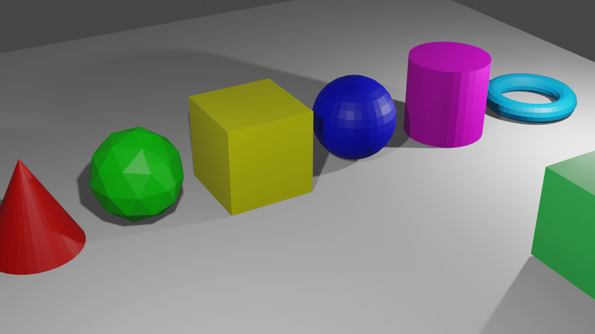
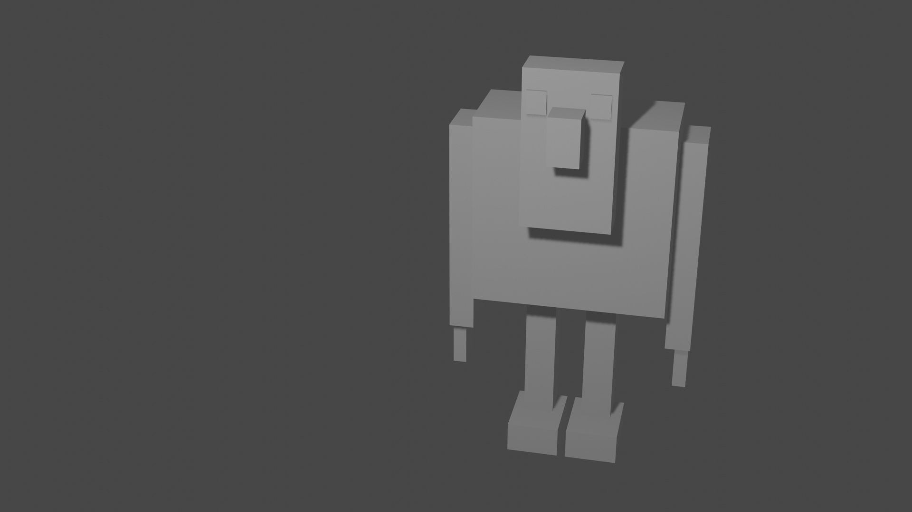
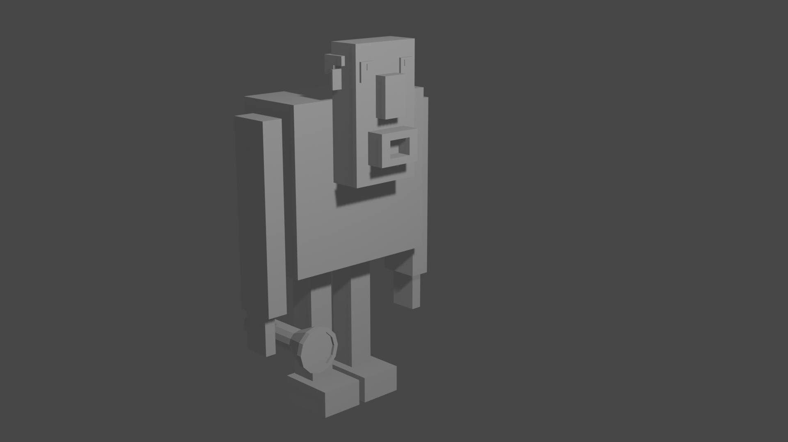

# :mortar_board: Blender 2.8 for beginners full course

:link: [Blender 2.8 for beginners full course][course] (YouTube)

## Part 1

## Part 2

## Part 3

## Part 4

[course]: https://www.youtube.com/playlist?list=PLn3ukorJv4vs_eSJUQPxBRaDS8PrVmIri
