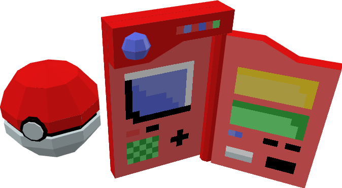

# :mortar_board: Low-Poly Modelling

:link: [YouTube Playlist](https://www.youtube.com/playlist?list=PLxfQIomHccxu7iEawHA82iDFtIA6Phzd3) -- Brandon James Greer

:heavy_check_mark: Completed  
:o: Incomplete

## :beginner: YouTube Tutorials

1. :heavy_check_mark: How to Make Low-Poly Models with Pixel Texture | Blockbench Tutorial
2. :o: Low-Poly Character Model in Blockbench | Timelapse & Commentary

## Projects

