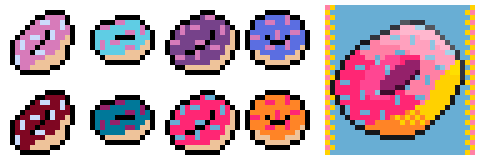

# :mortar_board: Learning Aseprite

:link: [aseprite.org](https://www.aseprite.org/)

:heavy_check_mark: Completed  
:o: Incomplete

## :beginner: Learning the Basics

1. :heavy_check_mark: [Aseprite Tutorial For Beginners (Pixel Art)](https://www.youtube.com/watch?v=tFsETEP01k8) -- Saultoons
2. :heavy_check_mark: [An Aseprite Crash Course In 30 Minutes](https://www.youtube.com/watch?v=59Y6OTzNrhk) -- AdamCYounis
3. :heavy_check_mark: [Aseprite Tutorials](https://www.youtube.com/playlist?list=PLR3Ra9cf8aV2Zl8LIqT93rsgnpkSvmevk) -- MortMort
4. :heavy_check_mark: [20 Hints and Tips for Aseprite [Aseprite Tutorial]](https://www.youtube.com/watch?v=va-sxKT4-qU) -- Comp-3 Interactive

## :beginner: Tileset Tutorials

1. :heavy_check_mark: [Tileset Workflow (Pixel Art & Gamedev Tutorial)](https://www.youtube.com/watch?v=btnH0x7_1g8) -- MortMort

## :beginner: Animation Tutorials

1. [How to Animate Pixels! - Animation Basics](https://www.youtube.com/watch?v=5cxBn_NZ-7E&list=WL) -- Dillon Designs Art

## Images

## :memo: Version

These files was created with Aseprite 1.2.25

## :page_with_curl: License

  
This work is licensed under a [Creative Commons Attribution-ShareAlike 4.0 International License](http://creativecommons.org/licenses/by-sa/4.0/)
